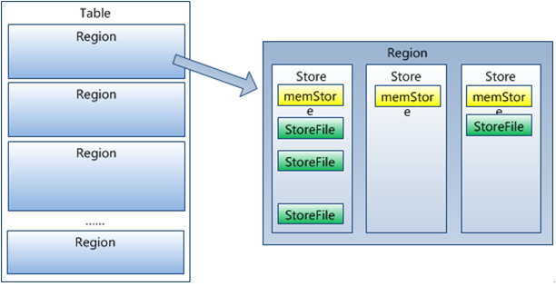

# HBase

1. 数据类型单一：Hbase中的数据都是字符串，没有类型。
2. Cell: Data is stored in cells. The data is dumped into cells which are specifically identified by rowkey and column qualifiers. (数据被转储到由行键和列限定符明确标识的单元格中)
3. A **region** contains all the rows between the start key and the end key assigned to that region. HBase tables can be divided into a number of regions in such a way that all the columns of a column family is stored in one region. Each region contains the rows in a sorted order.
4. Region虽然是分布式存储的最小单元，但并不是存储的最小单元。Region由一个或者多个Store组成，每个列族 (Column Family) 创建一个 Store 实例；每个Strore又由一个memStore和0至多个StoreFile组成，每个 StoreFile 都会对应一个 HFile，HFile 就是实际的存储文件；memStore存储在内存中，StoreFile存储在HDFS上。

5. HBase适用场景
   1. 写密集型应用，每天写入量巨大，而相对读数量较小的应用，比如IM的历史消息，游戏的日志等等; **主要适用于海量明细数据（十亿、百亿）的随机实时查询**，如日志明细、交易清单、轨迹行为
   2. 不需要复杂查询条件来查询数据的应用，HBase只支持基于rowkey的查询，对于HBase来说，单条记录或者小范围的查询是可以接受的，大范围的查询由于分布式的原因，可能在性能上有点影响，而对于像SQL的join等查询，HBase无法支持。
   3. 对性能和可靠性要求非常高的应用，由于HBase本身没有单点故障，可用性非常高。
6. HBase优点：
   1. 列可以动态增加，并且列为空就不存储数据,节省存储空间
   2. HBase自动切分数据，使得数据存储自动具有水平scalability
   3. HBase可以提供高并发读写操作的支持
7. HBase缺点：
   1. 不能支持条件查询，只支持按照Row key来查询.
   2. 不适合于大范围扫描查询
   3. 不支持事务
   4. 不直接支持 SQL 的语句查询
8. ff

## References
1. [HBase总结](https://andr-robot.github.io/HBase%E6%80%BB%E7%BB%93/)