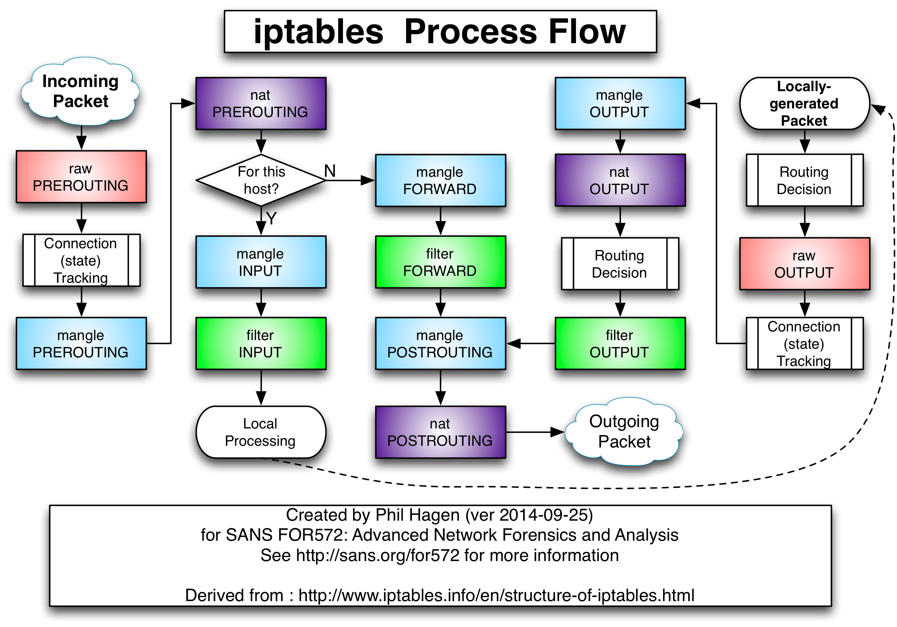

# LVS (Linux Virtual Server) / IPVS(IP Virtual Server)

1. LVS的结构主要分为两部分:
   1. 工作在内核空间的IPVS模块。LVS的能力实际上都是由IVPS模块实现。
   2. 工作在用户空间的ipvsadm管理工具。其作用是向用户提供一个命令接口，用于将配置的虚拟服务、真实服务等传给IPVS模块。
2. ipvs 和iptables 都是**基于netfilter的**。ipvs 会使用 iptables 进行包过滤、SNAT、masquared。
3. IP隧道（IP tunneling）是将一个IP报文封装在另一个IP报文的技术，这可以使得目标为一个IP地址的数据报文能被封装和转发到另一个IP地址。IP隧道技 术亦称为IP封装技术（IP encapsulation）。IP隧道主要用于移动主机和虚拟私有网络（Virtual Private Network），在其中隧道都是静态建立的，隧道一端有一个IP地址，另一端也有唯一的IP地址。
4. **Cross-host networking model** :
   1. direct routing: BGP, etc
   2. tunneling: VxLAN, IPIP, GRE, etc
   3. NAT: e.g. docker’s bridge network mode
5. ff

# ipvsadm / IPVS
1. ipvsadm related commands
    ```bash
    #  generate a virtual server:
    ipvsadm -A -t 10.131.208.21:80 -s rr

    # Add a real server with masquerading
    ipvsadm -a -t 10.131.208.21:80 -r 192.168.0.5 -w 1 -m

    # Edit the real server without specifying the -m
    ipvsadm -e -t 10.131.208.21:80 -r 192.168.0.5 -w 0 -m

    # Delete virtual service
    ipvsadm -D -t 10.131.208.21:80

    # Show stats
    ipvsadm -L -n --stats --rate

    ?? iptables ---> ipset ---> ipvsadm
    ```
2. ipvsadm **Used to set, maintain or check the virtual server table in the Linux kernel**. Linux virtual servers can be used to build scalable network services based on clusters of two or more nodes. The active node of the cluster redirects service requests to the server host collection that will actually perform the service. Supported functions include two protocols (TCP and UDP), three packet forwarding methods (NAT, tunneling, and direct routing), and eight load balancing algorithms (weighted round robin, minimum connection, weighted minimum connection, location-based minimum connection, Location-based minimal connection with replication, target hash, and source hash).
3. **When is route lookup performed when a packet flows through iptables**?
4. The kube-proxy IPVS routing mode moves the service routing and NATing out of the Netfilter rules, for the most part, although it does still make use of Netfilter.
5. ff

## ipvsadm references
1. [Building a Load Balancer with LVS - Linux Virtual Server 2013](http://www.linux-admins.net/2013/01/building-load-balancer-with-lvs-linux.html)
2. [Ipvsadm command reference](https://www.programmersought.com/article/9104230176/)
3. [**k8s集群中ipvs负载详解**](https://www.jianshu.com/p/89f126b241db?utm_campaign=maleskine&utm_content=note&utm_medium=seo_notes&utm_source=recommendation)  Great
4. [浅谈Kubernetes Service负载均衡实现机制](https://www.infoq.cn/article/p0v9d4br7udzwtgihuyq)
5. [浅析kube-proxy中的IPVS模式 2019](https://www.heguang-tech.com/blog/2020/kubernetes/reference/ipvs/)
6. [Cracking kubernetes node proxy (aka kube-proxy) 2019](https://arthurchiao.art/blog/cracking-k8s-node-proxy/#ch_6)
7. [lvs documentation](http://www.linuxvirtualserver.org/Documents.html)


# ipset
1. IP sets are a framework inside the Linux kernel, which can be administered by the **ipset utility**. Depending on the type, an IP set may store IP addresses, networks, (TCP/UDP) port numbers, MAC addresses, interface names or combinations of them in a way, which ensures lightning speed when matching an entry against a set.
2. ff


## ipset references
1. [ipset man page](https://ipset.netfilter.org/ipset.man.html)


# iptables
1. **iptables process flow**
   1. Routing Decision After **nat PREROUTING** :  内核进行路由判断，判断当前数据包的目的IP是否为本机网口的IP地址
   2. Routing Decision After **Locally generated Packet** : 内核进行路由判断，判断当前数据包要发往那个网口
   3. Routing Decision After **nat OUTPUT** : The real story is that packets are routed before OUTPUT,but they are rerouted here is the destination changes
    
2. Each iptables rule has a matching component and an action component:
   1. **Matching** : Rules can be constructed to match by **protocol type, destination or source address, destination or source port, destination or source network, input or output interface, headers, or connection state** among other criteria. These can be combined to create fairly complex rule sets to distinguish between different traffic.
   2. **Target** : A target is the action that are triggered when a packet meets the matching criteria of a rule.
   3. **Actions**:
      1. ACCEPT：允许数据包通过。
      2. DROP：直接丢弃数据包，不给任何回应信息，这时候客户端会感觉自己的请求泥牛入海了，过了超时时间才会有反应。
      3. REJECT：拒绝数据包通过，必要时会给数据发送端一个响应的信息，客户端刚请求就会收到拒绝的信息。
      4. SNAT：源地址转换，解决内网用户用同一个公网地址上网的问题。
      5. MASQUERADE：是SNAT的一种特殊形式，适用于动态的、临时会变的ip上。
      6. DNAT：目标地址转换。
      7. REDIRECT：在本机做端口映射。
      8. LOG：在/var/log/messages文件中记录日志信息，然后将数据包传递给下一条规则，也就是说除了记录以外不对数据包做任何其他操作，仍然让下一条规则去匹配。
3. ff

## iptables references
1. [iptables详解及一些常用规则](https://www.jianshu.com/p/ee4ee15d3658)
2. [A Deep Dive into Iptables and Netfilter Architecture](https://www.digitalocean.com/community/tutorials/a-deep-dive-into-iptables-and-netfilter-architecture)
3. [Packet flow in Netfilter and General Networking](https://upload.wikimedia.org/wikipedia/commons/3/37/Netfilter-packet-flow.svg)
4. [The netfilter hooks in the kernel and where they hook in the packet flow](https://gist.github.com/egernst/2c39c6125d916f8caa0a9d3bf421767a) github
5. [iptables tutorials](https://www.frozentux.net/iptables-tutorial/chunkyhtml/index.html)


# Connection Tracking
1. linux **conntrack** commands :
2. 在NAT Gateway收到客户机发来的请求包后，做源地址转换，并且将该连接记录保存下来，当NAT Gateway收到服务器来的响应包后，查找Track Table，确定转发目标，做目的地址转换，转发给客户机。


## Connection Tracking References
1. [Connection Tracking (conntrack): Design and Implementation Inside Linux Kernel 2020](http://arthurchiao.art/blog/conntrack-design-and-implementation/)
2. [How does connection tracking track connections changed by NAT?](https://superuser.com/questions/1269859/linux-netfilter-how-does-connection-tracking-track-connections-changed-by-nat)